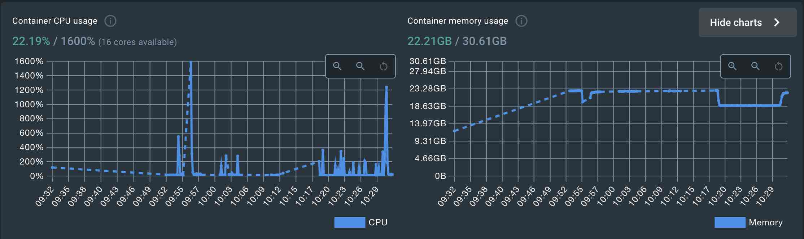
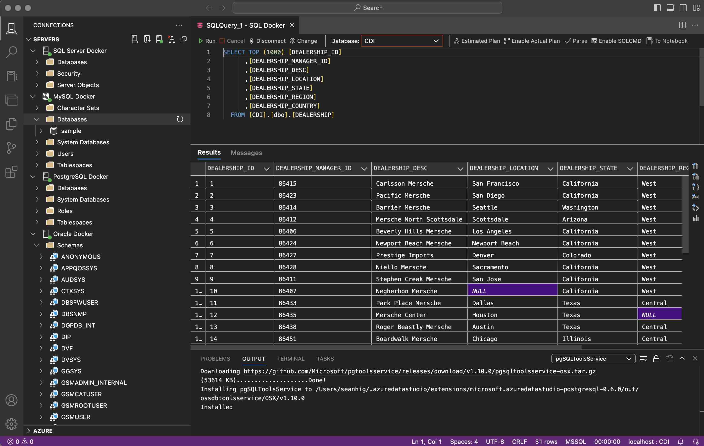

The Database Stack
==================

A set of popular database systems organized into a single `docker compose` stack for testing and development.

Database containers all use `docker volumes` and can be started and stopped as required without data loss.

## Requirements

- Docker Desktop or Docker w/ `docker-compose`
- Oracle Container Registry account (for oracle download)
- Bash

## Oracle Setup Notes

The stack includes the latest `Oracle Enterprise` container, which is only available from the Oracle Container Registry.  

1. Create an OCR account if you don't have one [https://container-registry.oracle.com/](https://container-registry.oracle.com/).
2. Create an `Auth Token` from the Sign-in user drop down.
3. Use the Auth Token as the password for `docker login`:

```
docker login container-registry.oracle.com
Username: <Your OCR account>
Password: <Auth Token>
Login Succeeded
```

4. Pull the `Oracle Enterprise` Container:

```
docker pull container-registry.oracle.com/database/enterprise:latest
```

It is a large container and will take some time to download.  Once downloaded the `database-stack` can be launched and will include `Oracle Enterprise`.

> To use without Oracle simply comment out (or remove) the `oracle:` service and related `volumes`.

### Usage

`bash launch-stack.sh`

## Notes

- Azure Data Studio has extensions for all of databases in the stack, and it is relatively easy to connect to the database servers.
- There is a `bastion` container running `ubuntu 22.04` in the `database-stack`, this can be used for working within the docker network and validating connectivity.
- All container instances have `/host` mounted to the local `./host` folder for easy file exchange, backups, etc.
- For Oracle, when connecting use the format: `localhost:1521/<OracleSIDName>` to avoid TNSNAMES related errors and avoid having to setup an Oracle client on the host.
- To connect to `Oracle Enterprise Mangager Express` in the `oracle` container, from the host, use the url: `https://localhost:5500/em` and enter the `sys` or `system` credentials.  Use `CDB$ROOT` for the __Container__ name.

## The Kafka Stack

The `kafka-stack` folder contains another `docker-compose` stack which connects to the same `database-stack_default` network, allowing all containers to communicate using docker service DNS names.

See the `kafka-stack` [Readme](kafka-stack/README.md) for more information.

## Resources

Running both the `database-stack` and the `kafka-stack` will require (and consume) a fair bit of machine resources.

Eg.



Stopping unused services or stacks can be helpful.

## Resetting the Stack

The containers all make use of docker volumes to enable stopping and starting without data loss, so make sure to delete all associated stack volumes to fully reset the stack and associated databases.

## Azure Data Studio

With the extensions installed Azure Data Studio can connect, query and manage all the databases in the stack:



